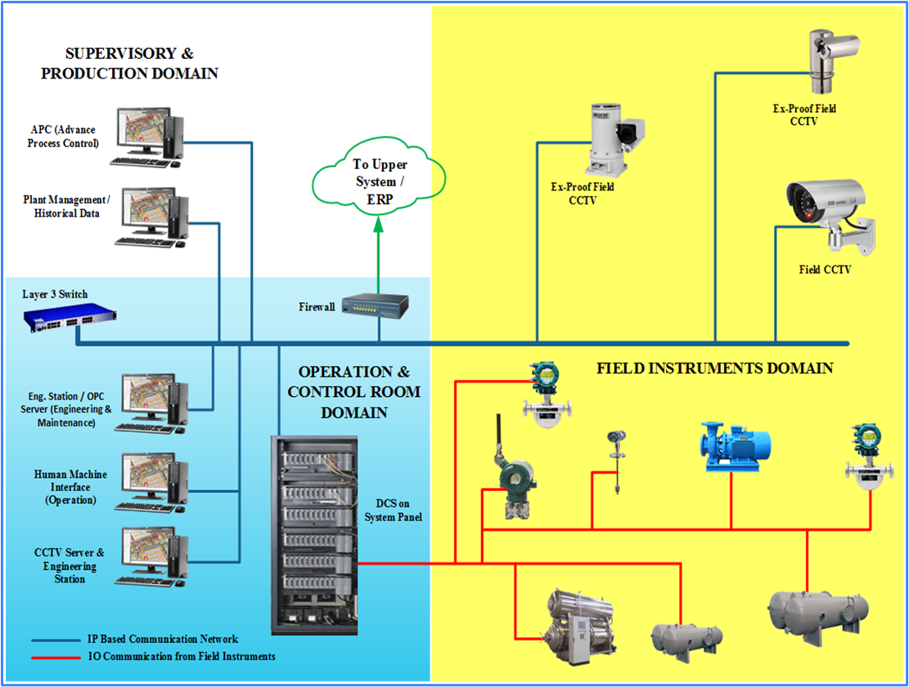

# DCS (Distributed Control System)

## Overview of Typical DCS Projects

Period of Service: February 2008 - October 2013

The project was to design, implement, and construct various control system, in an effort to replace or migrate the existing and obsolete system or other competitors’ system product by utilizing latest Yokogawa DCS (Centum VP platform), instruments, as well as other computer and supporting information technologies.

## Role
### Lead Project Engineer
1. Facilitating the Project Manager as well as Engineering Manager, maintain and monitoring the projects.
2. Leading an engineering team that consists of system engineer, project engineer, technicians, drafter, and document control.
3. Collaborating with procurement staff, project quality control, sales, and administration.
4. Maintaining communication and project updates with customers and stakeholders!

## Typical Works (Some pictures are intentionally blurred)
1. Hardware Design for Operation Console

  
  
2. System Generation - Plant Overview Panel

  
  
3. System Generation - Control Group Trend Analysis Panel

  

4. Panel Loopcheck - Commissioning / Site Acceptance Test
  
  
  
5. Panel Historical Dashboard

  
  
6. Operation Panel for Plant Operation

  
  
## Project Experiences / Portfolios

| Projects | Client / End User | Year |
| ------ | ------ | ------ |
| Tjiwi Kimia - Retrofit DCS Cogen 1&2, Mojokerto | Tjiwi Kimia | 2013 |
| POSCO Remote Engineering Project (Commissioning Phase), Cilegon, Banten | Yokogawa Korea Company / Krakatau POSCO | 2013 |
| HOLCIM - Centum CS Migration to Centum VP, Narogong | Holcim Indonesia | 2012 / 2013 |
| PKT (POPKA) - Centum CS Upgrading to Centum VP, Bontang, East Kalimantan | Pupuk Kalimantan Timur | 2012 / 2013 |
| KPI – MMI Migration Centum CS to Centum VP, Bontang, East Kalimantan | Kaltim Parna Industri | 2012 / 2013 |
| KMI - Centum CS Upgrading to Centum VP, Bontang, East Kalimantan | Kaltim Methanol Industri | 2012 |
| Indorama MMI Migration to Centum VP, Purwakarta, West Java | Indorama Synthetics Tbk | 2012 |
| Smelting Total Migration Centum CS to VP, Gresik | Smelting | 2012 |
| Fuji to Centum VP DCSs Migration, Serang, Banten | Dian Swastatika Sentosa - IKPP | 2011 |
| Tjiwi Kimia Soda Membrane 1 DCS Upgrade, Mojokerto | Tjiwi Kimia | 2010 / 2011 |
| ITS Micro-XL to Centum VP Migration, Tangerang | Indonesia Toray Synthetics | 2010 |
| CGS 1-4-5 Plant Monitoring System, Duri, Riau | Chevron Pacific Indonesia | 2009 / 2010 |
| South Pacific Viscose Line-4 (SPV L-4), Purwakarta | South Pacific Viscose | 2010 |
| CCTV Project on Santos Oyong Development Project Phase II Onshore Processing Facilities (OPF), Grati, Pasuruan | PAL Indonesia / Santos Oil Company | 2009 / 2010 |
| CGS-5 DCS Migration Project, Duri, Riau | Chevron Pacific Indonesia | 2009 |
| Balongan Refinery Unit VI Retrofit Project, Indramayu | Pertamina RU VI | 2008 / 2009 |
